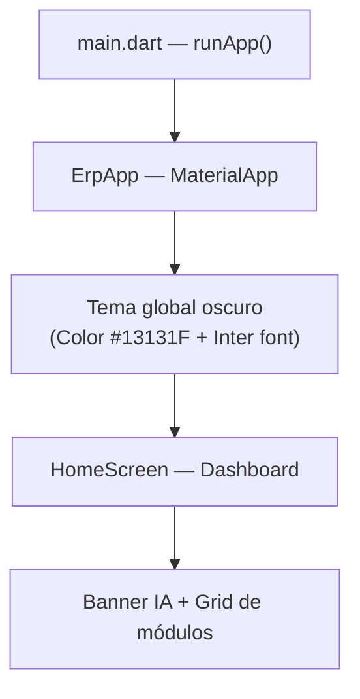
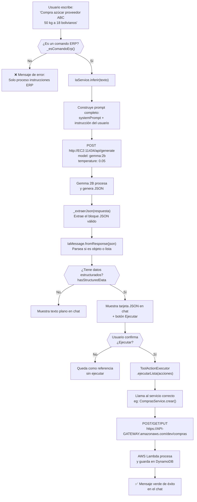
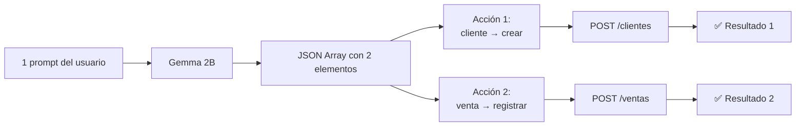
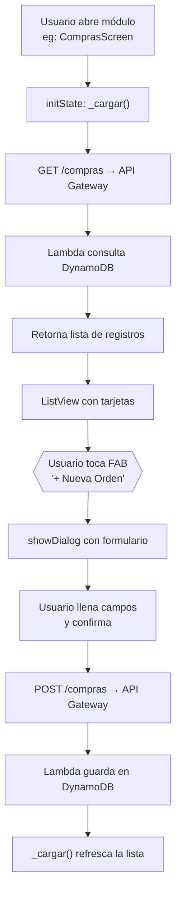

# 📱 Flujo de la Aplicación Móvil — ERP Serverless

> Aplicación Flutter que conecta un backend Serverless en AWS con un modelo de IA (Gemma 2B) para gestionar un ERP mediante lenguaje natural.

---

## 🏗️ Arquitectura General

```
┌─────────────────────────────────────────┐
│          APP MÓVIL (Flutter)            │
│                                         │
│   HomeScreen                            │
│   ├── Módulos CRUD (5 pantallas)        │
│   └── Asistente IA (Chat)              │
└──────────┬────────────────┬────────────┘
           │                │
           ▼                ▼
┌─────────────────┐  ┌──────────────────┐
│   AWS API       │  │  EC2 (Ollama)    │
│   Gateway       │  │  Gemma 2B model  │
│   + Lambda      │  │  Puerto 11434    │
│   + DynamoDB    │  └──────────────────┘
└─────────────────┘
```

---

## 📂 Estructura del Proyecto

```
lib/
├── main.dart                     ← Punto de entrada, tema global
├── config/
│   └── api_config.dart           ← URLs de AWS y EC2 centralizadas
├── models/
│   ├── cliente.dart              ← Modelo de datos: Cliente
│   ├── producto.dart             ← Modelo de datos: Producto
│   ├── compra.dart               ← Modelo de datos: Compra
│   ├── venta.dart                ← Modelo de datos: Venta
│   ├── inventario.dart           ← Modelo de datos: Inventario
│   └── ia_message.dart           ← Modelo del chat IA (roles, JSON)
├── services/
│   ├── ia_service.dart           ← Comunicación con Ollama (EC2)
│   ├── tool_action_executor.dart ← Ejecuta acciones IA → API
│   ├── clientes_service.dart     ← HTTP al endpoint /clientes
│   ├── productos_service.dart    ← HTTP al endpoint /productos
│   ├── inventario_service.dart   ← HTTP al endpoint /inventario
│   ├── compras_service.dart      ← HTTP al endpoint /compras
│   └── ventas_service.dart       ← HTTP al endpoint /ventas
└── screens/
    ├── home_screen.dart           ← Dashboard principal
    ├── ia/
    │   └── ia_chat_screen.dart   ← Chat con el Asistente IA
    ├── productos/
    ├── clientes/
    ├── inventario/
    ├── compras/
    └── ventas/
```

---

## 🚀 Flujo 1 — Inicio de la Aplicación



**Explicación:**
1. `main.dart` inicializa Flutter y configura la barra de estado transparente.
2. `ErpApp` aplica el tema global: **modo oscuro**, fuente **Inter** (Google Fonts), colores primarios `#6C63FF` (violeta) y `#03DAC6`.
3. La pantalla inicial es `HomeScreen`, que muestra:
   - Un **banner destacado** para abrir el Asistente IA.
   - Una **grilla 2×3** con los 5 módulos ERP.

---

## 🤖 Flujo 2 — Asistente IA (el más importante)

Este es el flujo completo cuando el usuario escribe una instrucción en lenguaje natural.



### Paso a paso detallado:

#### **Paso 1 — El usuario escribe**
El campo de texto acepta lenguaje natural. También hay chips de ejemplo predefinidos que el usuario puede tocar para autocompletar.

#### **Paso 2 — Filtro local `_esComandoErp()`**
Antes de llamar a Ollama, la app verifica si el texto contiene palabras clave ERP (`registrar`, `crear`, `listar`, `compra`, `venta`, `stock`, etc.). Esto evita llamadas innecesarias al modelo.

#### **Paso 3 — Llamada a Ollama en EC2**
`IaService` construye un **prompt completo** que incluye:
- Un **system prompt** que instruye al modelo a responder **solo con JSON**.
- Ejemplos de few-shot (entradas y salidas esperadas).
- La instrucción del usuario al final.

La llamada HTTP va al servidor **Ollama en EC2** (`http://18.231.249.239:11434/api/generate`) con el modelo `gemma:2b` y temperatura `0.05` (muy baja = respuestas más deterministas/predecibles).

#### **Paso 4 — Extracción del JSON**
El método `_extraerJson()` busca en la respuesta del modelo el primer bloque JSON válido (ya sea un `[array]` o un `{objeto}`). Esto es necesario porque Gemma a veces agrega texto libre alrededor del JSON.

#### **Paso 5 — Parseo del mensaje**
`IaMessage.fromResponse()` parsea el JSON y determina:
- Si es una **lista** → multi-intención (varias acciones a ejecutar).
- Si es un **objeto** → una sola acción.
- Si el `tool` es `"desconocido"` → se descarta como no-ERP.

#### **Paso 6 — Confirmación del usuario**
Aparece un diálogo mostrando las acciones detectadas (ej: `compra → registrar`). El usuario decide si ejecutarlas o no.

#### **Paso 7 — Ejecución en el API**
`ToolActionExecutor` recibe la lista de acciones y las ejecuta en secuencia. Para cada acción, llama al servicio correspondiente que hace la petición HTTP al **API Gateway de AWS**.

---

## 🔢 Flujo 3 — Multi-Intención

Cuando el usuario escribe **más de una instrucción en un mismo mensaje**:

**Ejemplo:** `"Registrar cliente Maria Lopez y registrar venta de arroz 10 unidades a 15 bolivianos"`



El sistema procesa las acciones **en secuencia** y muestra un resultado individual para cada una.

---

## 📦 Flujo 4 — Módulos CRUD Manuales

Cada módulo (Productos, Clientes, Inventario, Compras, Ventas) tiene el mismo patrón:



**Todos los módulos comparten esta estructura:**

| Componente | Función |
|---|---|
| `initState` | Carga los datos al abrir la pantalla |
| `RefreshIndicator` | Permite hacer pull-to-refresh |
| `FloatingActionButton` | Abre el formulario de creación |
| `SnackBar` | Confirma éxito o error de la operación |

---

## 🌐 Endpoints del API Gateway

| Módulo | Método | Endpoint |
|---|---|---|
| Productos | GET / POST | `/productos` |
| Productos | PUT / DELETE | `/productos/{id}` |
| Clientes | GET / POST | `/clientes` |
| Clientes | PUT / DELETE | `/clientes/{id}` |
| Inventario | GET | `/inventario` |
| Inventario | POST | `/inventario/movimiento` |
| Inventario | GET | `/inventario/alertas` |
| Compras | GET / POST | `/compras` |
| Compras | PUT | `/compras/{id}/recibir` |
| Ventas | GET / POST | `/ventas` |
| Ventas | POST | `/ventas/{id}/cancelar` |
| Ventas | GET | `/ventas/reportes` |

**Headers obligatorios en todas las peticiones:**
```json
{
  "Content-Type": "application/json",
  "x-api-role": "admin",
  "x-tenant-id": "default"
}
```

---

## 🧩 Modelo de Datos del Chat IA (`IaMessage`)

Cada mensaje en el chat tiene un **rol** que define cómo se renderiza:

| Rol | Color | Descripción |
|---|---|---|
| `user` | Violeta (degradado) | Mensaje del usuario, alineado a la derecha |
| `assistant` | Oscuro con borde violeta | Respuesta del modelo con tarjeta JSON |
| `error` | Rojo oscuro | Error de conexión o ejecución |
| `resultado` | Verde oscuro | Confirmación de acción ejecutada en el ERP |
| `loading` | Gris con spinner | Mientras espera respuesta del modelo |

---

## ⚙️ Configuración del Modelo IA

| Parámetro | Valor | Razón |
|---|---|---|
| **Modelo** | `gemma:2b` | Ligero, funciona en EC2 t2.medium |
| **Temperature** | `0.05` | Respuestas deterministas (JSON consistente) |
| **top_p** | `0.9` | Limita variabilidad |
| **num_predict** | `512` | Máximo de tokens generados |
| **keep_alive** | `10m` | Mantiene el modelo en RAM para reducir latencia |
| **Timeout** | `120s` | Gemma 2B puede tardar en inferir |

---

## 🔄 Warm-Up del Modelo

Al abrir la pantalla de IA, la app ejecuta `IaService.warmUp()` en segundo plano:

```
App abre IaChatScreen
        ↓
warmUp() → POST /api/generate con "hola" (1 token)
        ↓
Gemma 2B se carga en la RAM de la EC2
        ↓
Las siguientes inferencias son más rápidas
```

Esto reduce la latencia de la **primera consulta real** del usuario.

---

## 📌 Resumen Visual del Sistema Completo

```
USUARIO
  │
  │  Lenguaje Natural
  ▼
┌─────────────────────────┐
│   Flutter App (Móvil)   │
│  ┌───────────────────┐  │
│  │  IaChatScreen     │  │
│  │  - Filtro ERP     │  │
│  │  - Muestra JSON   │  │
│  │  - Confirmación   │  │
│  └────────┬──────────┘  │
│           │             │
│  ┌────────▼──────────┐  │
│  │  IaService        │──────────────► EC2 + Ollama
│  └───────────────────┘  │            Gemma 2B
│                         │            (genera JSON)
│  ┌───────────────────┐  │
│  │ToolActionExecutor │  │
│  └────────┬──────────┘  │
│           │             │
│  ┌────────▼──────────┐  │
│  │  *Service (HTTP)  │──────────────► AWS API Gateway
│  └───────────────────┘  │            → Lambda
└─────────────────────────┘            → DynamoDB
```
