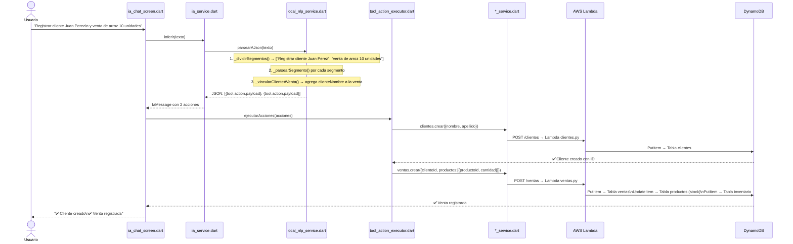

# 🧠 Arquitectura Completa: NLP → ERP Serverless

## 📁 Mapa de Archivos que se Comunican

```
mobile_app/lib/
├── config/
│   └── api_config.dart          ← URLs de AWS y Ollama (central de configs)
│
├── services/
│   ├── local_nlp_service.dart   ← 🧠 MOTOR NLP (gramática + regex)
│   ├── ia_service.dart          ← Orquestador IA (Local vs Ollama)
│   ├── tool_action_executor.dart ← Ejecutor de acciones → llama a servicios ERP
│   ├── productos_service.dart   ← HTTP GET/POST/PUT → Lambda productos.py
│   ├── clientes_service.dart    ← HTTP GET/POST     → Lambda clientes.py
│   ├── compras_service.dart     ← HTTP GET/POST     → Lambda compras.py
│   ├── ventas_service.dart      ← HTTP GET/POST     → Lambda ventas.py
│   └── inventario_service.dart  ← HTTP GET/POST     → Lambda inventario.py
│
└── screens/
    └── ia_chat_screen.dart      ← UI: recibe texto del usuario
```

---

## 🔄 Flujo Completo — De la Palabra a DynamoDB



---

## 🧠 Detalle del Motor NLP — Gramática y Regex

### Paso 1: Normalización (`_norm()`)
```dart
// Convierte texto a minúsculas sin acentos
"Registrar CLIENTE Ángel López" → "registrar cliente angel lopez"

// Regex para acentos:
const ac = 'áéíóúàèìòùäëïöüâêîôûãõñÁÉÍÓÚ...';
const nm = 'aeiouaeiouaeiouaeiouaeiouaon...';
```

### Paso 2: Segmentación (`_dividirSegmentos()`)
```dart
// Divide por " y " (evitando "precio a X")
"crear cliente Juan y listar productos"
       ↓ split(r'\s+y\s+')
["crear cliente Juan", "listar productos"]

// Protege casos como "precio de arroz a 20 y stock"
// → "a 20" no se separa (empieza con dígito)
```

### Paso 3: Clasificación por Intención (`_parsearSegmento()`)
```
Palabras clave → Función extractor
─────────────────────────────────────────────────────────
"registrar cliente"  → _parsearCrearCliente()
"crear cliente"      ↗
"nuevo cliente"      ↗
"register client"    ↗  (Español + Inglés)

"listar producto"    → _accion('producto', 'listar', {})
"ver productos"      ↗
"mostrar productos"  ↗

"crear producto"     → _parsearCrearProducto()
"nuevo producto"     ↗

"actualizar precio"  → _parsearActualizarPrecio()
"cambiar precio"     ↗

"compra de"          → _parsearRegistrarCompra()
"comprar"            ↗
"purchase of"        ↗

"venta de"           → _parsearRegistrarVenta()
"registrar venta"    ↗
"sell product"       ↗
```

### Paso 4: Extracción de Entidades (Regex)

#### 📧 Email
```dart
RegExp(r'[\w.+-]+@[\w-]+\.\w+')
// "juan@gmail.com" → grupo completo
```

#### 📞 Teléfono
```dart
RegExp(r'\b\d{7,}\b')
// "75123456" → "75123456"
```

#### 💰 Número tras palabra clave (`_extraerNumeroTras`)
```dart
RegExp('${clave}\s+(\d+\.?\d*)')
// "precio 20"      → 20.0
// "bs 15.5"        → 15.5
// "stock 100"      → 100.0
// "unidades 50"    → 50.0
```

#### 📦 Nombre de producto entre delimitadores (`_extraerProductoEntre`)
```dart
// "compra de [ARROZ] proveedor ABC"
//   inicio: ["compra de", "de"]
//   fin:    ["proveedor", "precio", r'\d']
// Resultado: "arroz"

// "precio del [AZUCAR] a 18"
//   inicio: ["precio del", "precio de", "del"]
//   fin:    ["a ", "bs", "bolivianos"]
// Resultado: "azucar"
```

#### 👤 Nombre de cliente (`_parsearCrearCliente`)
```dart
// "registrar cliente Juan Lopez email tel 75000000"
// 1. Extrae email con regex → lo quita
// 2. Extrae teléfono con regex → lo quita
// 3. Filtra stopWords: {registrar, crear, cliente, nombre...}
// 4. Palabras[0] = nombre = "Juan"
//    Palabras[1] = apellido = "Lopez"
```

---

## 🔗 Vinculación Multi-Acción (`_vincularClienteAVenta`)

```
Input: "Registrar cliente Maria Lopez y venta de arroz 10 unidades"

  Acción 1: {tool:"cliente", action:"crear", payload:{nombre:"Maria", apellido:"Lopez"}}
  Acción 2: {tool:"venta",   action:"registrar", payload:{producto:"arroz", cantidad:10}}
                                                                   ↑ sin clienteNombre!

  _vincularClienteAVenta() detecta:
  → Hay una acción cliente.crear con nombre "Maria Lopez"
  → Hay una acción venta.registrar SIN clienteNombre
  → Inyecta: payload['clienteNombre'] = "Maria Lopez"

  Resultado:
  Acción 2: {tool:"venta", action:"registrar", payload:{producto:"arroz", cantidad:10, clienteNombre:"Maria Lopez"}}
                                                                                        ↑ ✅ vinculado automáticamente
```

---

## ⚙️ Executor: Resolución Nombre → ID DynamoDB

```
tool_action_executor.dart

venta.registrar recibe: {producto:"arroz", cantidad:10, clienteNombre:"Maria Lopez"}

  Step 1: GET /productos → busca "arroz" por nombre fuzzy
          _normalizar("arroz") == _normalizar(prod.nombre)
          → prodV.id = "99667a5b-abaf-4a51-a305-09a774223bdc"

  Step 2: GET /clientes → busca "Maria Lopez" por nombre fuzzy
          _resolverClientePorNombre("Maria Lopez")
          → coincidencia exacta: clienteIdV = "316d991c-..."

  Step 3: POST /ventas con payload EXACTO del Lambda:
          {
            "clienteId": "316d991c-...",      ← ID real ✅
            "productos": [{
              "productoId": "99667a5b-...",   ← ID real ✅
              "cantidad": 10
            }]
          }
```

---

## 📡 Payloads Exactos que Envían los Services

| Endpoint | Payload |
|---|---|
| `POST /clientes` | `{ "nombre": "Juan", "apellido": "Perez" }` |
| `POST /productos` | `{ "nombre": "arroz", "precio": 20, "stock": 100 }` |
| `PUT /productos/:id` | `{ "precio": 25 }` |
| `POST /compras` | `{ "proveedor": "ABC", "productos": [{"productoId":"uuid","cantidad":50,"precioUnitario":18}] }` |
| `POST /ventas` | `{ "clienteId": "uuid", "productos": [{"productoId":"uuid","cantidad":10}] }` |
| `PUT /inventario/movimiento` | `{ "productoId": "uuid", "tipo": "entrada", "cantidad": 100 }` |

---

## 🏗️ Arquitectura Backend AWS

```
Celular (Flutter APK)
    │
    │ HTTPS + Headers:
    │   x-api-role: admin
    │   x-tenant-id: default
    ▼
API Gateway (wc4m2zupe2.execute-api.us-east-2.amazonaws.com/dev)
    │
    ├─ /productos  → Lambda productos.py  → DynamoDB tabla "productos"
    ├─ /clientes   → Lambda clientes.py   → DynamoDB tabla "clientes"
    ├─ /compras    → Lambda compras.py    → DynamoDB tabla "compras"
    ├─ /ventas     → Lambda ventas.py     → DynamoDB tablas "ventas" + "productos" + "inventario"
    └─ /inventario → Lambda inventario.py → DynamoDB tabla "inventario"
```

---

## ✅ Checklist para el Jueves

| Requisito | Implementación | Archivo |
|---|---|---|
| Lenguaje natural → acción | Gramática + Regex Dart | `local_nlp_service.dart` |
| Corre en el dispositivo | Dart compilado en APK | 100% on-device |
| Sin backend externo para NLP | No hay llamadas HTTP en el NLP | `local_nlp_service.dart` |
| Inserta en el ERP | HTTP → Lambda → DynamoDB | `*_service.dart` |
| Multi-intención | `_dividirSegmentos()` + `_vincularClienteAVenta()` | `local_nlp_service.dart` |
| ES + EN | Palabras clave en ambos idiomas | `_parsearSegmento()` |
