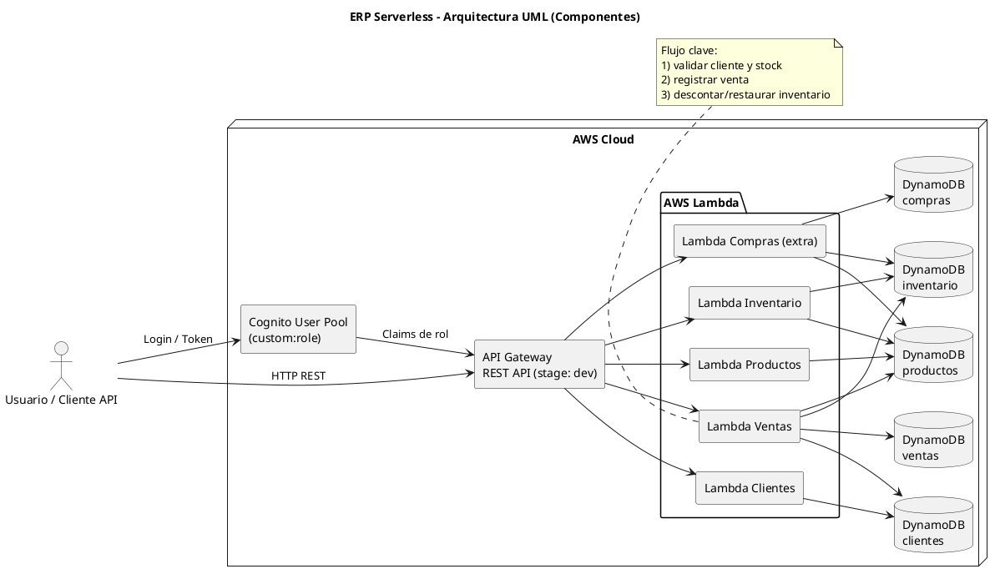
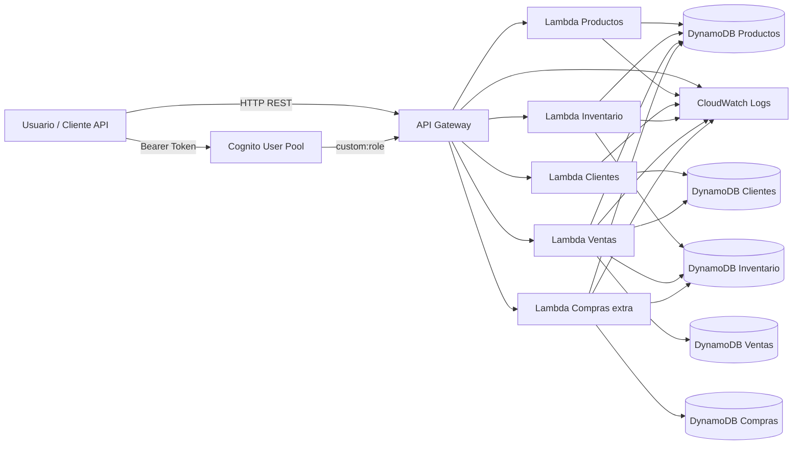
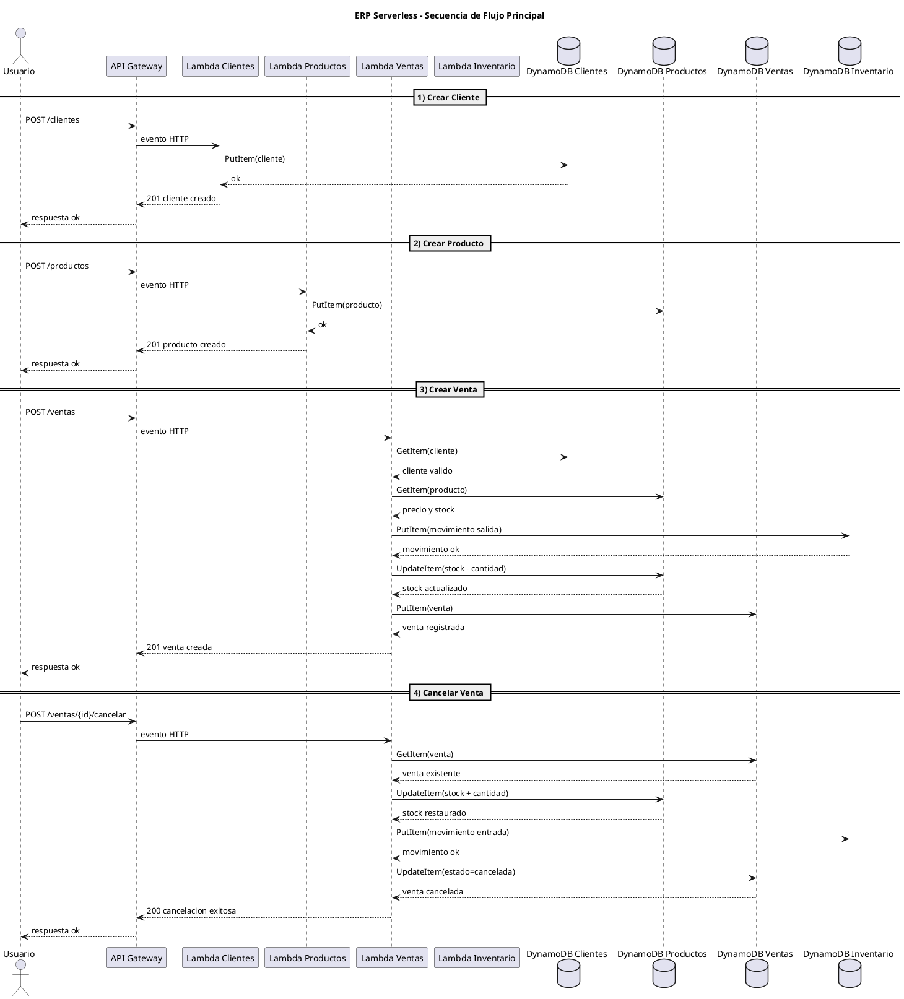
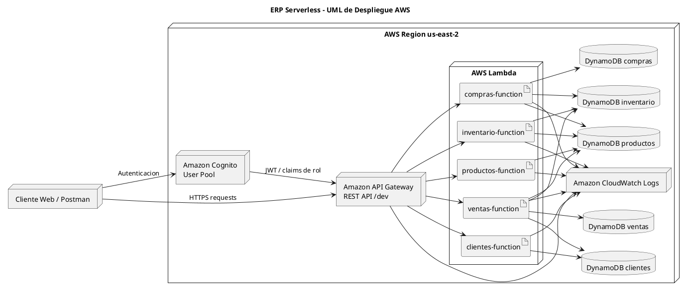

# Arquitectura ERP Serverless

## UML (PlantUML)

Diagrama UML de componentes para entender la arquitectura serverless completa.

## Mermaid

Diagrama Mermaid listo para pegar/exportar.

## Resumen de flujo principal

1. Se crea cliente.
2. Se crea producto con stock inicial.
3. Se registra venta y baja stock.
4. Se cancela venta y se restaura stock.

Evidencia validada en local: `10 -> 8 -> 10`.

## UML de Secuencia (PlantUML)

Flujo completo: Cliente -> Producto -> Venta -> Cancelacion.

## UML de Despliegue (PlantUML)

Vista de nodos AWS para presentacion.

